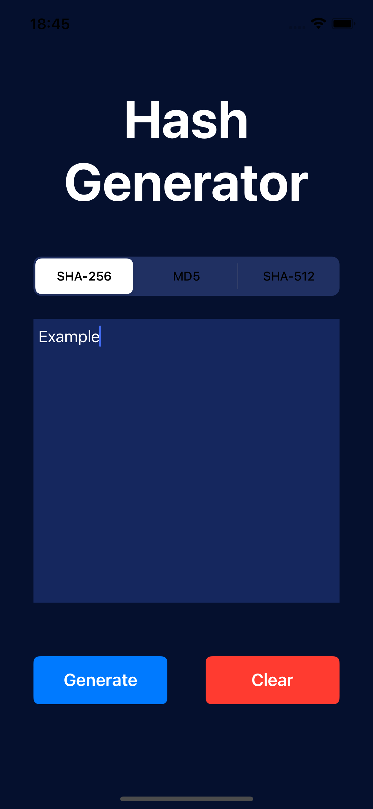
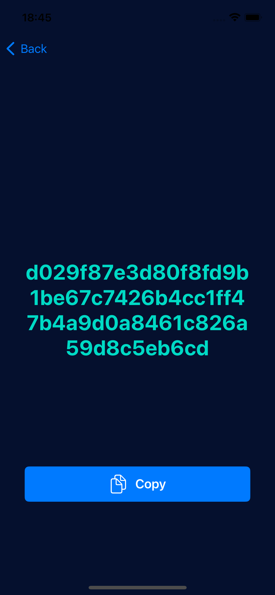
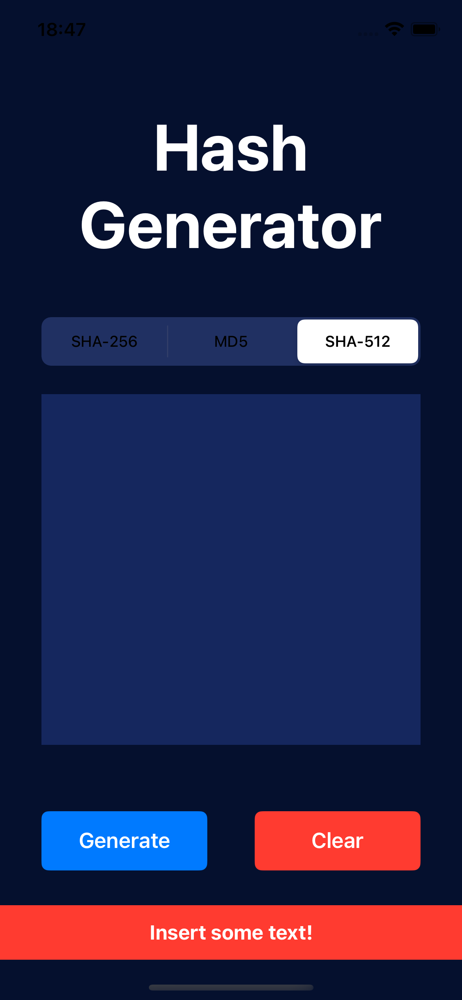

# swift-hash-generator
An App that based upon some algorithm selected by the user, generates the hash code

## 🔧 Used resources

### UIKit Components:
- UIViewController
- NavigationController
- UIPasteboard
- UIButton

## Images

  
  
  
  

## Developed with:

## 🔖 License

### Contact

